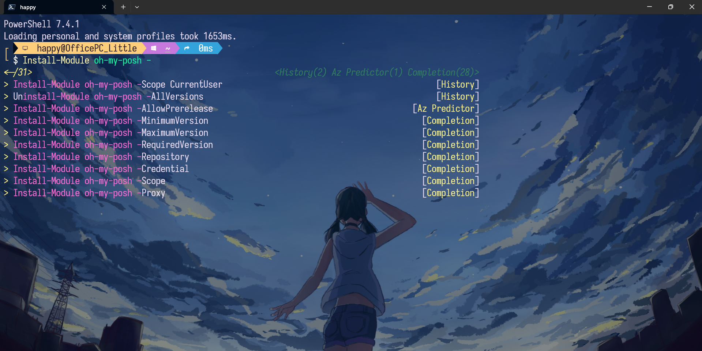

# Powershell 机器学习智能提示（IntelliSense）配置完全指南

[简体中文](https://github.com/happylittle2010/PowerShell-ML-IntelliSense-Guide-zh) | [English](https://github.com/happylittle2010/PowerShell-ML-IntelliSense-Guide)

Powershell中的PSReadLine插件提供了基于历史记录的智能提示功能，此外，还有几款插件可提供基于机器学习的智能提示。全部配置完成后，可在Powershell里实现类似IDE的智能提示体验。

(图中效果即来自于历史记录和插件的智能提示)

## 安装 Windows Terminal（非必要）
建议安装 Windows Terminal 作为默认终端：
[安装并开始设置 Windows 终端](
https://learn.microsoft.com/zh-cn/windows/terminal/install)

## 使用 Winget 安装 Powershell 7
搜索最新版本的 PowerShell:
```PowerShell
winget search Microsoft.PowerShell
```
使用 id 参数安装 PowerShell:
```PowerShell
winget install --id Microsoft.Powershell --source winget
```

## 安装 PSReadLine
使用 PowerShellGet 安装 PSReadLine：
```PowerShell
Install-Module -Name PSReadLine
```

## 安装基于机器学习的 IntelliSense 插件
安装Az.Accounts插件（智能提示插件Az.Tools.Predictor的前置插件）：
```PowerShell
Install-module -name Az.Accounts -Force
```

安装Az.Tools.Predictor插件：
```PowerShell
Install-module -name Az.Tools.Predictor -Force
```

启用Az.Tools.Predictor插件：
```PowerShell
Enable-AzPredictor -AllSession
```

安装CompletionPredictor插件：
```PowerShell
Install-Module -Name CompletionPredictor -Repository PSGallery
```

## 配置 Powershell
用记事本打开 Powershell 配置文件：
```PowerShell
notepad $PROFILE
```

以上命令如果出错，先创建配置文件：
```PowerShell
New-Item -Path $PROFILE -Type File -Force
```

在打开的配置文件里，粘贴上如下配置内容：
```ps1
# 导入智能提示模块
Import-Module PSReadLine
Import-Module Az.Tools.Predictor
Import-Module -Name CompletionPredictor

# 设置 IntelliSense 预测来源和历史记录和插件
Set-PSReadLineOption -PredictionSource HistoryAndPlugin
```

保存配置文件并重新加载（或者重启Powershell）：
```PowerShell
. $PROFILE
```

这样，Powershell 就拥有了基于机器学习的智能提示。智能提示有两种展示方式，一种是行内展示，输入时按 `右箭头` 选择预测结果。另一种是列表预测视图，输入时可按 `上/下方向键` 选择预测结果。

按 `F2` 切换 `行内预测` 和 `列表预测` 模式。如果要让 Powershell 每次启动都自动切换到 `列表预测` 模式，在配置文件里加上这句内容：
```ps1
Set-PSReadLineOption -PredictionViewStyle ListView
```

## 其它提示和补全插件
oh-my-posh 插件可提供 Powershell 美化、git 信息展示，posh-git 插件可提供 git 命令的智能补全。例如，安装 posh-git 插件后，键入 `git ch` ，然后按  `Tab` 键，会自动补全为 `git checkout` ，继续按 `Tab` 键，会在例如 `git cherry` 和 `git cherry-pick`等命令之间循环。

### oh-my-posh 插件安装和配置
通过 winget 安装：
```PowerShell
winget install JanDeDobbeleer.OhMyPosh -s winget
```

 > 使用 oh-my-posh 插件时需要配套使用 Nerd 字体，否则会出现乱码。 [Nerd Fonts](https://www.nerdfonts.com/font-downloads) 这个网站收录了一些常用的Nerd字体。

通过这个命令可调出所有 oh-my-posh 主题：
```PowerShell
Get-PoshThemes
```

选择了喜欢的主题后（例如选择markbull主题）， 再次进入 Powershell 配置文件，在里面加入如下内容：
```ps1
# 配置 oh-my-posh 为防病毒软件例外，并选择markbull主题为默认主题
oh-my-posh init pwsh --config "$env:POSH_THEMES_PATH/markbull.omp.json" | Invoke-Expression
```

配置完成后，保存配置文件并重新加载（或者重启Powershell）：
```PowerShell
. $PROFILE
```

### posh-git 插件安装和配置
```PowerShell
Install-Module posh-git -Scope CurrentUser -Force
```
安装完成后，在 Powershell 配置文件里添加如下内容：
```ps1
# 导入智能提示模块
Import-Module posh-git
```

## 常见问题

### 为什么在VSCode/Jetbrains编辑器的终端中出现了乱码
请修改对应编辑器终端的字体为 Nerd 字体。

## 相关链接
[在 PSReadLine 中使用预测器](
https://learn.microsoft.com/zh-cn/powershell/scripting/learn/shell/using-predictors?view=powershell-7.4)

[Announcing General Availability of Az.Tools.Predictor](
https://techcommunity.microsoft.com/t5/azure-tools-blog/announcing-general-availability-of-az-tools-predictor/ba-p/3297956)

[CompletionPredictor](
https://github.com/PowerShell/CompletionPredictor)

[Oh My Posh](
https://ohmyposh.dev/)

[posh-git](
https://github.com/dahlbyk/posh-git)
